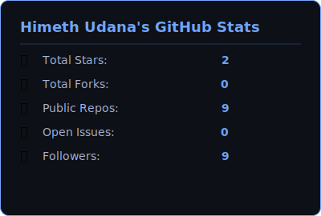
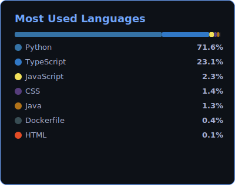

---

## About Me

I'm a **3rd-year Computer Engineering undergraduate** at the **University of Sri Jayewardenepura** with a strong interest in **Artificial Intelligence**, **Cybersecurity**, and **Full-Stack Development**. I enjoy building secure, scalable systems and solving complex problems at the intersection of technology, data, and trust.

My core competencies include **Python**, **Agentic AI** application development, **React**, **Next.js**, **TypeScript**, **Web3** technologies, and **Machine Learning**, with hands-on experience in system design, automation, and AI-driven applications.

---

## Tech Stack

**Languages**

**Frameworks**

**AI / ML**

**Databases**

**Tools & Protocols**

---

## Featured Projects

<table>
<tr>
<td width="50%" valign="top">

### [LexGuard](https://github.com/Himeth777/LexGuard)
**Blockchain-Based Digital Notary**

A decentralized application (dApp) that provides immutable proof of existence for legal documents. Leverages **Cardano's metadata architecture** to store SHA-256 cryptographic fingerprints on-chain, eliminating the need for a third-party notary.

- Client-side SHA-256 hashing for legal privacy
- Cardano metadata anchoring with timestamped transaction receipts
- Instant document verification against on-chain hash
- Downloadable Certificate of Notarization with QR code

</td>
<td width="50%" valign="top">

### [LegalLens](https://github.com/Himeth777/LegalLens)
**AI Compliance Copilot**

An AI-driven compliance auditing platform that evaluates documents against Sri Lankan (CBSL, FTRA, LFC) and international (FATF) financial regulations. Uses **Agentic RAG** to retrieve exact legal clauses and reason over them, producing risk scores with full citation trails.

- Agentic RAG pipeline over indexed legal documents
- PII redaction before analysis
- Structured risk scoring with clause-level citations
- Streaming clarification chat alongside audit results

</td>
</tr>
</table>

---

## GitHub Stats

---

## Let's Connect

*Open to collaborations on AI, ML, and data-intensive projects!*

---

  

